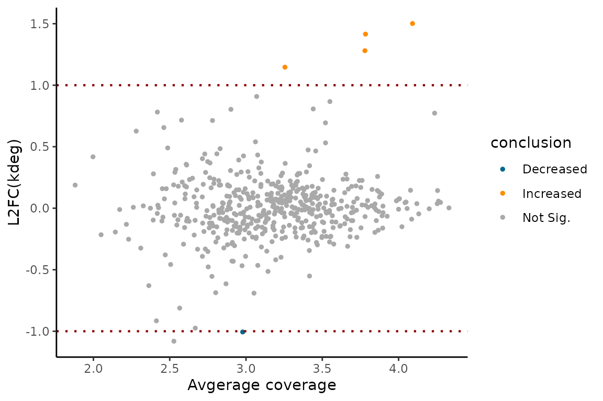
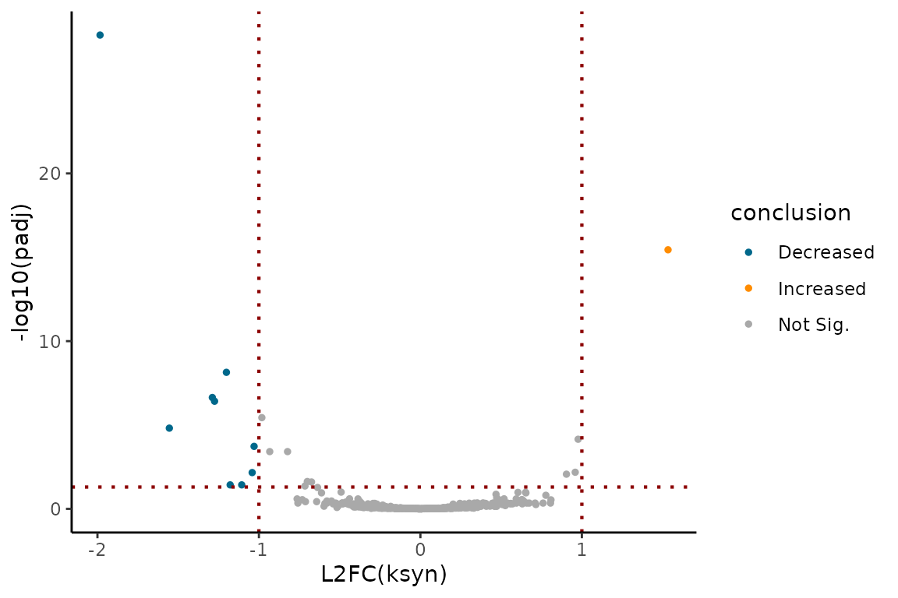
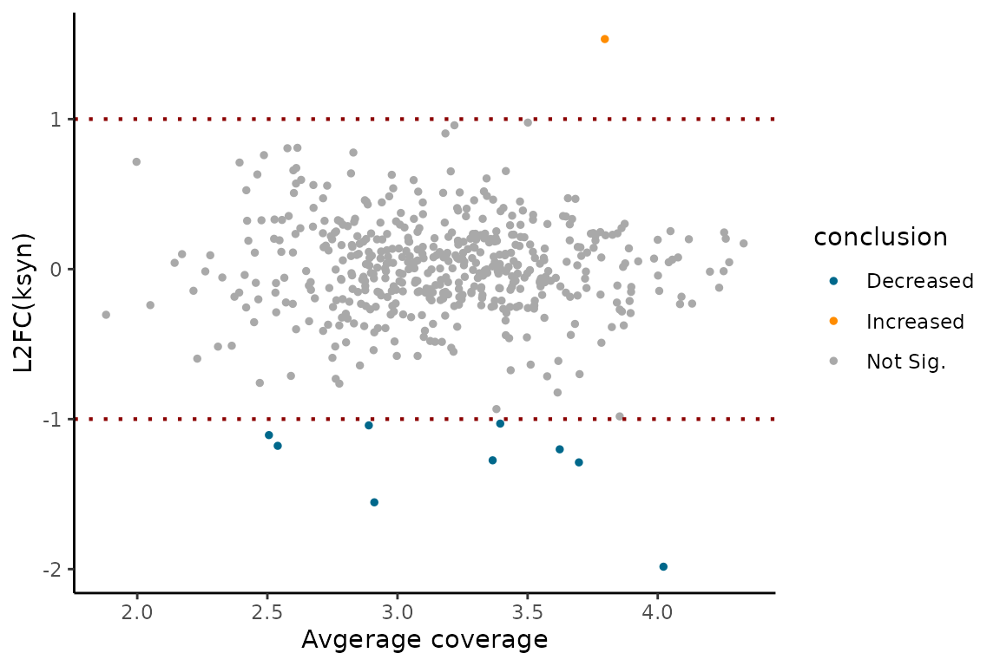

# Linear modeling in EZbakR

## Introduction

Typically, you will have multiple replicates of NR-seq data from two or
more “conditions”. In this case, it is common to want to compare kinetic
parameter estimates across the various conditions. In addition,
sometimes you will need to account for complex experimental designs and
potential batch effects. This is the task of generalized linear
modeling, and in this vignette, we will see how to perform this kind of
modeling in EZbakR. EZbakR significantly improves upon its predecessor,
bakR, by allowing users to specify any identifiable design matrix, thus
supporting a wider arrange of comparative analyses than was possible in
bakR.

``` r
library(EZbakR)
library(dplyr)
#> 
#> Attaching package: 'dplyr'
#> The following objects are masked from 'package:stats':
#> 
#>     filter, lag
#> The following objects are masked from 'package:base':
#> 
#>     intersect, setdiff, setequal, union
```

## Example scenarios

In this section, I will blaze through some common examples. I will
eventually write later sections to get into some of the details of
linear regression in case you need to more deeply understand how to
generalize beyond what I show in this section. In all cases, the
specification of the linear model that you would like to fit will be
done through the `formula_mean` argument of EZbakR’s
[`AverageAndRegularize()`](https://isaacvock.github.io/EZbakR/reference/AverageAndRegularize.md)
function.

### The simplest case: a single “condition” factor

Often, the difference between samples can be described with a single
factor. For example, you may have performed NR-seq in wild-type (WT)
cells, and a variety of knock-out (KO) cell lines. In this, case, there
will likely be a single experimental detail factor in your metadf:

| sample  |  tl | genotype |
|:--------|----:|:---------|
| sampleA |   0 | WT       |
| sampleB |   2 | WT       |
| sampleC |   2 | WT       |
| sampleD |   0 | KO       |
| sampleE |   2 | KO       |
| sampleF |   2 | KO       |

Here, I simulate and then fit the relevant model for both the
log(kdeg)’s as well as the log(ksyn)’s:

``` r
metadf <- tibble(sample = c("sampleA", "sampleB", "sampleC",
                            "sampleD", "sampleE", "sampleF"),
                 tl = c(0, 2, 2,
                        0, 2, 2),
                 genotype = c("WT", "WT", "WT",
                               "KO", "KO", "KO"))


# Simulate kdeg and ksyn differences
set.seed(43)
simdata <- EZSimulate(500,
                      metadf = metadf %>% dplyr::rename(label_time = tl),
                      mean_formula = ~genotype -1,
                      pdiff_ks = 0.1)


ezbdo <- EZbakRData(simdata$cB,
                    metadf)


ezbdo <- EstimateFractions(ezbdo)
#> Estimating mutation rates
#> Summarizing data for feature(s) of interest
#> Averaging out the nucleotide counts for improved efficiency
#> Estimating fractions
#> Processing output

ezbdo <- EstimateKinetics(ezbdo)

### Linear modeling in EZbakR:

# Estimate average log(kdeg) for each genotype
ezbdo <- AverageAndRegularize(ezbdo,
                              formula_mean = ~ genotype)
#> Fitting linear model
#> Estimating coverage vs. variance trend
#> Regularizing variance estimates

# Estimate average log(ksyn) for each genotype
ezbdo <- AverageAndRegularize(ezbdo,
                              parameter = "log_ksyn",
                              formula_mean = ~ genotype)
#> Fitting linear model
#> Estimating coverage vs. variance trend
#> Regularizing variance estimates


# Calculate difference in log(kdeg) between the two genotypes
ezbdo <- CompareParameters(ezbdo,
                           parameter = "log_kdeg",
                           design_factor = "genotype",
                           reference = "WT",
                           experimental = "KO")

# Calculate differe in log(ksyn) between the two genotypes
ezbdo <- CompareParameters(ezbdo,
                           parameter = "log_ksyn",
                           design_factor = "genotype",
                           reference = "WT",
                           experimental = "KO")
```

Everything is default EZbakR stuff discussed in other vignettes until we
get to
[`AverageAndRegularize()`](https://isaacvock.github.io/EZbakR/reference/AverageAndRegularize.md).
There, I am using the `formula_mean` parameter to describe how I want to
relate the parameter being averaged to factors in the metadf.
`~ genotype` means that I want to calculate average values of the
parameter for each value of `genotype` that appears in the metadf.

[`CompareParameters()`](https://isaacvock.github.io/EZbakR/reference/CompareParameters.md)
in this case can be used to get comparisons of the parameter averages in
the two genotypes. `design_factor` describes the multi-leveled factor
you included in your `formula_mean` that you would like to compare two
levels of. The difference in parameters is calculated as
`experimental` - `reference`. In this case, these differences will
represent log-fold differences in the kdegs and ksyns (since a
difference in logs is a log of a ratio; log(b) - log(a) = log(b/a)). If
you have more than two conditions in your data, nothing changes in how
you would run
[`AverageAndRegularize()`](https://isaacvock.github.io/EZbakR/reference/AverageAndRegularize.md),
but you would need to run
[`CompareParameters()`](https://isaacvock.github.io/EZbakR/reference/CompareParameters.md)
for each comparison you want to make.

You can visualize the comparative analysis results using MA plots or
volcano plots like so:

``` r
# Assess log(kdeg) differences
EZVolcanoPlot(ezbdo,
              parameter = "log_kdeg")
```


``` r
EZMAPlot(ezbdo,
              parameter = "log_kdeg")
```



``` r
# Assess log(ksyn) differences
EZVolcanoPlot(ezbdo,
              parameter = "log_ksyn")
```



``` r
EZMAPlot(ezbdo,
              parameter = "log_ksyn")
```



### Dealing with multiple factors: simple interaction model

What if there is more than one variable you tweak from replicate to
replicate? Maybe you have multiple cell lines with distinct genotypes,
but you also treat these cell lines with a drug in some cases? Your
metadf may look like:

| sample  |  tl | genotype | treatment |
|:--------|----:|:---------|:----------|
| sampleA |   0 | WT       | nodrug    |
| sampleB |   2 | WT       | nodrug    |
| sampleC |   2 | WT       | nodrug    |
| sampleD |   0 | WT       | drug      |
| sampleE |   2 | WT       | drug      |
| sampleF |   2 | WT       | drug      |
| sampleG |   0 | KO       | nodrug    |
| sampleH |   2 | KO       | nodrug    |
| sampleI |   2 | KO       | nodrug    |
| sampleJ |   0 | KO       | drug      |
| sampleK |   2 | KO       | drug      |
| sampleL |   2 | KO       | drug      |

The simplest thing to do in this case is to estimate average parameter
values for each unique combination of your two (or more) factors. This
can be done with a simple `formula_mean` of `~ genotype:treatment`:

``` r
metadf <- tibble(
  sample = c("sampleA", "sampleB", "sampleC",
             "sampleD", "sampleE", "sampleF",
             "sampleG", "sampleH", "sampleI",
             "sampleJ", "sampleK", "sampleL"),
  tl = c(0, 2, 2,
         0, 2, 2,
         0, 2, 2,
         0, 2, 2),
  genotype = c("WT", "WT", "WT",
               "WT", "WT", "WT",
               "KO", "KO", "KO",
               "KO", "KO", "KO"),
  treatment = c("nodrug", "nodrug", "nodrug",
                "drug", "drug", "drug",
                "nodrug", "nodrug", "nodrug",
                "drug", "drug", "drug")
)


# Simulate kdeg and ksyn differences
set.seed(43)
simdata <- EZSimulate(500,
                      metadf = metadf %>% dplyr::rename(label_time = tl),
                      mean_formula = ~genotype:treatment -1,
                      pdiff_ks = 0.1)


ezbdo <- EZbakRData(simdata$cB,
                    metadf)


ezbdo <- EstimateFractions(ezbdo)
#> Estimating mutation rates
#> Summarizing data for feature(s) of interest
#> Averaging out the nucleotide counts for improved efficiency
#> Estimating fractions
#> Processing output

ezbdo <- EstimateKinetics(ezbdo)

### Linear modeling in EZbakR:

# Estimate average log(kdeg) for each genotype
ezbdo <- AverageAndRegularize(ezbdo,
                              formula_mean = ~ genotype:treatment)
#> Fitting linear model
#> Estimating coverage vs. variance trend
#> Regularizing variance estimates

# Estimate average log(ksyn) for each genotype
ezbdo <- AverageAndRegularize(ezbdo,
                              parameter = "log_ksyn",
                              formula_mean = ~ genotype:treatment)
#> Fitting linear model
#> Estimating coverage vs. variance trend
#> Regularizing variance estimates


# Calculate difference in log(kdeg) between WT drug and no drug
ezbdo <- CompareParameters(ezbdo,
                           parameter = "log_kdeg",
                           design_factor = "",
                           reference = "genotypeWT:treatmentnodrug",
                           experimental = "genotypeWT:treatmentdrug")

# Calculate difference in log(kdeg) between KO drug and no drug
ezbdo <- CompareParameters(ezbdo,
                           parameter = "log_kdeg",
                           design_factor = "",
                           reference = "genotypeKO:treatmentnodrug",
                           experimental = "genotypeKO:treatmentdrug")

# Calculate difference in log(kdeg) between KO and WT nodrug
ezbdo <- CompareParameters(ezbdo,
                           parameter = "log_kdeg",
                           design_factor = "",
                           reference = "genotypeWT:treatmentnodrug",
                           experimental = "genotypeKO:treatmentnodrug")


### You could do same for log_ksyn
```

The quirk in this case is how to use `CompareParameters`. You have to
set `design_factor` to a blank string, and then list the full parameter
names in `reference` and `experimental`. You can see the parameter names
by looking at the metadata for the relevant `AverageAndRegularize`
object:

``` r
ezbdo$metadata$averages$logkdeg_feature$fit_params
#> [1] "genotypeKO:treatmentdrug"   "genotypeKO:treatmentnodrug"
#> [3] "genotypeWT:treatmentdrug"   "genotypeWT:treatmentnodrug"
```

It’s a bit of a hack, and I hope to have a more intuitive option for
this case in the near future. I’ll note though, that there was an easier
way in this case. This interaction model works just like a single
parameter model with a factor with one level per unique combination of
factors. So you could have defined a metadf that looks like:

``` r
metadf$condition <- factor(paste0(metadf$genotype, metadf$treatment))
metadf
```

| sample  |  tl | genotype | treatment | condition |
|:--------|----:|:---------|:----------|:----------|
| sampleA |   0 | WT       | nodrug    | WTnodrug  |
| sampleB |   2 | WT       | nodrug    | WTnodrug  |
| sampleC |   2 | WT       | nodrug    | WTnodrug  |
| sampleD |   0 | WT       | drug      | WTdrug    |
| sampleE |   2 | WT       | drug      | WTdrug    |
| sampleF |   2 | WT       | drug      | WTdrug    |
| sampleG |   0 | KO       | nodrug    | KOnodrug  |
| sampleH |   2 | KO       | nodrug    | KOnodrug  |
| sampleI |   2 | KO       | nodrug    | KOnodrug  |
| sampleJ |   0 | KO       | drug      | KOdrug    |
| sampleK |   2 | KO       | drug      | KOdrug    |
| sampleL |   2 | KO       | drug      | KOdrug    |

and then set `formula_mean` in
[`AverageAndRegularize()`](https://isaacvock.github.io/EZbakR/reference/AverageAndRegularize.md)
to `~condition`. This hack comes from the [DESeq2
documentation](https://www.bioconductor.org/packages/release/bioc/vignettes/DESeq2/inst/doc/DESeq2.html#interactions),
so check that out for an alternate discussion.

### Dealing with multiple factors: estimating an actual interaction term

Ok, but what if in the two or more factor case you want to specify and
regress out an actual interaction effect? The interpretation of the
parameters in such a model is a bit more complicated, but here’s how you
would fit such a model:

``` r

# factor() ensures that WT + nodrug is treated as the reference
# which probably makes more intuitive sense
metadf <- tibble(
  sample = c("sampleA", "sampleB", "sampleC",
             "sampleD", "sampleE", "sampleF",
             "sampleG", "sampleH", "sampleI",
             "sampleJ", "sampleK", "sampleL"),
  tl = c(0, 2, 2,
         0, 2, 2,
         0, 2, 2,
         0, 2, 2),
  genotype = factor(c("WT", "WT", "WT",
               "WT", "WT", "WT",
               "KO", "KO", "KO",
               "KO", "KO", "KO"),
               levels = c("WT", "KO")),
  treatment = factor(c("nodrug", "nodrug", "nodrug",
                "drug", "drug", "drug",
                "nodrug", "nodrug", "nodrug",
                "drug", "drug", "drug"),
                levels = c("nodrug", "drug"))
)


# Simulate kdeg and ksyn differences
set.seed(43)
simdata <- EZSimulate(500,
                      metadf = metadf %>% dplyr::rename(label_time = tl),
                      mean_formula = ~genotype*treatment -1,
                      pdiff_ks = 0.1)


ezbdo <- EZbakRData(simdata$cB,
                    metadf)


ezbdo <- EstimateFractions(ezbdo)
#> Estimating mutation rates
#> Summarizing data for feature(s) of interest
#> Averaging out the nucleotide counts for improved efficiency
#> Estimating fractions
#> Processing output

ezbdo <- EstimateKinetics(ezbdo)

### Linear modeling in EZbakR:

# Estimate average log(kdeg) for each genotype
ezbdo <- AverageAndRegularize(ezbdo,
                              formula_mean = ~ genotype*treatment)
#> Fitting linear model
#> 
#> Estimating coverage vs. variance trend
#> Regularizing variance estimates

# Estimate average log(ksyn) for each genotype
ezbdo <- AverageAndRegularize(ezbdo,
                              parameter = "log_ksyn",
                              formula_mean = ~ genotype*treatment)
#> Fitting linear model
#> 
#> Estimating coverage vs. variance trend
#> Regularizing variance estimates


# Viewing parameters will be easier in the future
ezbdo$metadata$averages$logkdeg_feature$fit_params
#> [1] "genotypeWT"               "genotypeKO"              
#> [3] "treatmentdrug"            "genotypeKO:treatmentdrug"
```

This model is a bit quirky and has the following 4 parameters:

1.  `genotypeWT`: This represents the average WT, nodrug parameter
    value.
2.  `genotypeKO`: This represents the average KO, nodrug parameter
    value.
3.  `treatmentdrug`: This represents the average effect of drug
    treatment **on just the reference level genotype (WT in this
    case)**.
4.  `genotypeKO:treatmentdrug`: This is the “interaction term”, but more
    intuitively represents the difference in the KO and WT drug effects.

With this in mind, some things you can do with
[`CompareParameters()`](https://isaacvock.github.io/EZbakR/reference/CompareParameters.md)
includes:

``` r
# Assess significance of interaction term
ezbdo <- CompareParameters(ezbdo,
                           parameter = "log_kdeg",
                           param_name = "genotypeKO:treatmentdrug")

# Assess significance of drug effect on WT
ezbdo <- CompareParameters(ezbdo,
                           parameter = "log_kdeg",
                           param_name = "treatmentdrug")

# Assess difference of WT and KO
ezbdo <- CompareParameters(ezbdo,
                           parameter = "log_kdeg",
                           design_factor = "genotype",
                           reference = "WT",
                           experimental = "KO")
```

Assessing the impact of drug treatment on the non-reference genotype is
currently not possible, but will be through the currently inactive
`param_function` parameter in
[`CompareParameters()`](https://isaacvock.github.io/EZbakR/reference/CompareParameters.md).
This is because this situation is unique in that you need to assess the
sum of three parameters (`genotypeKO`, `treatmentdrug`, and
`genotypeKO:treatmentdrug`). Alternatively, the drug impact on KO can be
estimated more simply using the model discussed in the last section.

### Regressing out potential batch effects

The final common situation to discuss is when you have multiple factors
in your metadf, but some of them represent technical factors rather than
biological ones. These technical factors constitute what are often
called “batches”, which are technical factors that can influence
parameter estimates and thus risk being a confounder in your analyses.
Linear modeling offers a simple strategy for attempting to deal with
this problem. Consider the following metadf:

| sample  |  tl | genotype | batch |
|:--------|----:|:---------|:------|
| sampleA |   0 | WT       | A     |
| sampleB |   2 | WT       | A     |
| sampleC |   2 | WT       | B     |
| sampleD |   2 | WT       | A     |
| sampleE |   2 | WT       | B     |
| sampleF |   0 | KO       | A     |
| sampleG |   2 | KO       | A     |
| sampleH |   2 | KO       | B     |
| sampleI |   2 | KO       | A     |
| sampleJ |   2 | KO       | B     |

There is a technical factor I am calling “batch” that we suspect may
influence our NR-seq data, independent of any biological difference
between the two genotypes. We would like to “regress out” this technical
effect. This can be done by specifying `~genotype + batch` in the
`formula_mean` of
[`AverageAndRegularize()`](https://isaacvock.github.io/EZbakR/reference/AverageAndRegularize.md).:

``` r
# factor() ensures that WT is treated as the reference
# which probably makes more intuitive sense
metadf <- tibble(sample = c("sampleA", 
                            "sampleB", "sampleC", "sampleD", "sampleE",
                            "sampleF", 
                            "sampleG", "sampleH", "sampleI", "sampleJ"),
                 tl = c(0, 
                        2, 2, 2, 2,
                        0, 
                        2, 2, 2, 2),
                 genotype = factor(c("WT",
                              "WT", "WT", "WT", "WT",
                              "KO",
                              "KO", "KO", "KO", "KO"),
                              levels = c("WT", "KO")),
                 batch = c("A", 
                           "A", "B", "A", "B",
                           "A", 
                           "A", "B", "A", "B"))

# Simulate kdeg and ksyn differences
set.seed(43)
simdata <- EZSimulate(500,
                      metadf = metadf %>% dplyr::rename(label_time = tl),
                      mean_formula = ~genotype + batch -1,
                      pdiff_ks = 0.1)


ezbdo <- EZbakRData(simdata$cB,
                    metadf)


ezbdo <- EstimateFractions(ezbdo)
#> Estimating mutation rates
#> Summarizing data for feature(s) of interest
#> Averaging out the nucleotide counts for improved efficiency
#> Estimating fractions
#> Processing output

ezbdo <- EstimateKinetics(ezbdo)

### Linear modeling in EZbakR:

# Estimate average log(kdeg) for each genotype
ezbdo <- AverageAndRegularize(ezbdo,
                              formula_mean = ~ genotype + batch)
#> Fitting linear model
#> 
#> Estimating coverage vs. variance trend
#> Regularizing variance estimates

# Estimate average log(ksyn) for each genotype
ezbdo <- AverageAndRegularize(ezbdo,
                              parameter = "log_ksyn",
                              formula_mean = ~ genotype + batch)
#> Fitting linear model
#> 
#> Estimating coverage vs. variance trend
#> Regularizing variance estimates


# Viewing parameters will be easier in the future
ezbdo$metadata$averages$logkdeg_feature$fit_params
#> [1] "genotypeWT" "genotypeKO" "batchB"
```

The three parameters are:

1.  `genotypeWT`: Average WT parameter value, with the batch averages
    “regressed out”.
2.  `genotypeKO`: Average KO parameter value, with batch averages
    regressed out.
3.  `batchB`: Average difference between the batches, when accounting
    for apparent biological differences between the batches.

Unlike in the interaction model (`~genotype*treatment`), the parameters
`genotypeWT` and `genotypeKO` are no longer simple averages of samples
with the relevant factor value. Rather, they represent an average that
accounts for differences between batches in the same biological
conditions.

**MAJOR NOTE:**
[`AverageAndRegularize()`](https://isaacvock.github.io/EZbakR/reference/AverageAndRegularize.md)
will fail with an error if your model is not “identifiable”. That means,
if you don’t have enough independent data points to estimate all
parameters in your desired linear model, EZbakR won’t let you fit said
model. Consider the following metadf, which contains a technical factor
“batch” as in the other examples discussed in this section:

| sample  |  tl | genotype | batch |
|:--------|----:|:---------|:------|
| sampleA |   0 | WT       | A     |
| sampleB |   2 | WT       | A     |
| sampleC |   2 | WT       | A     |
| sampleD |   2 | WT       | A     |
| sampleE |   2 | WT       | A     |
| sampleF |   0 | KO       | B     |
| sampleG |   2 | KO       | B     |
| sampleH |   2 | KO       | B     |
| sampleI |   2 | KO       | B     |
| sampleJ |   2 | KO       | B     |

If you try and fit the model described in this section
(`formula_mean = ~genotype + batch`), EZbakR will fail with an error.
Why wasn’t it able to fit the same model with this slightly different
metadf? To fit this model, you need to be able to estimate the impact of
“batch” independent of the impact of “genotype”. In this case though,
all batch A’s are instances of “WT” datasets, and all batch B’s are
instances of “KO” datasets. Thus, the model cannot distinguish batch
effects from real biological differences. It would be like me asking you
to solve the equation 5 = x + z for x and z. There are an infinite
number of combinations of x and z that satisfy this equation.

**Conclusion:** If you suspect that batch effects could influence your
measurements (e.g., the day a sample was collected on, who collected the
sample, etc.) you need to ensure that these technical effects are evenly
distributed among your various biological conditions. Don’t process all
“WT” datasets on one day and all “KO” on a different day. Make sure
every batch of samples includes all biologically distinct conditions you
are testing.
